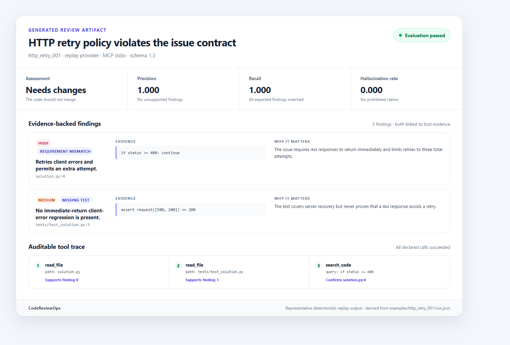
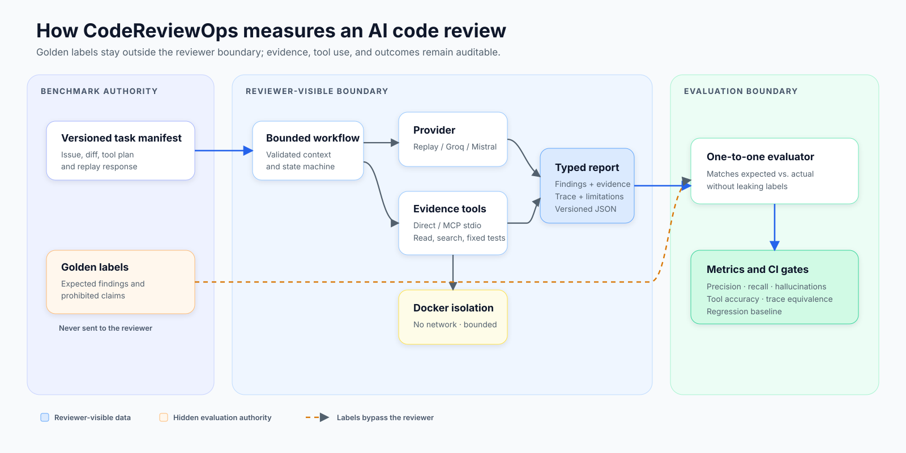

# CodeReviewOps

CodeReviewOps is a local, deterministic harness for measuring whether a code-review
agent finds expected problems in a pull request without inventing unsupported ones.
The current backend MVP combines reproducible replay, opt-in single-request Groq and
Mistral inference, bounded evidence tools, local MCP stdio transport, isolated fixture
tests, and a 25-task regression harness. SQLAlchemy and Alembic provide the persistence
foundation; a public API and dashboard remain planned work.

## Why this project matters

AI code review is easy to demo and difficult to measure. A plausible review can still miss
the required defect, invent an unsupported security issue, or depend on tools it never
actually used. CodeReviewOps turns those failure modes into typed, repeatable evaluation:

- expected findings are matched one-to-one instead of scored by vague similarity;
- misses, hallucinations, prohibited claims, tool use, and evidence provenance are explicit;
- replay runs are deterministic enough for CI regression gates;
- live-provider runs remain opt-in, single-request, and never silently retry or switch models;
- untrusted test fixtures run in a network-disabled, resource-bounded Docker sandbox.

## Proof at a glance

| Capability | Current implementation |
| --- | --- |
| Evaluation set | 25 generated, synthetic code-review tasks |
| Review paths | Deterministic replay plus opt-in Groq and Mistral |
| Tool transports | In-process direct tools and local MCP over stdio |
| Reliability gates | Precision, recall, hallucinations, category/severity accuracy, tool-plan accuracy, and trace equivalence |
| Isolation | Fixed Docker profile, no network, read-only inputs, resource and time limits |
| Persistence | SQLAlchemy models and an Alembic PostgreSQL foundation; runtime persistence is not wired yet |
| Verification | Linux CI, cross-platform type checks, offline tests, MCP integration, package build, and Docker integration |

See a real replay result: [rendered review](examples/http_retry_001/report.md) and
[versioned JSON artifact](examples/http_retry_001/run.json).

## Architecture

The reviewer never receives golden labels. Tool choices are declared by the benchmark,
and model output cannot supply shell commands, roots, environment variables, or Docker
images. See [the architecture notes](docs/architecture.md) for the trust boundaries and
execution paths.

## Core evaluation loop

- Loads an issue, pull-request diff, expected findings, and replay response from a
  versioned benchmark task.
- Gives the provider only review context, never golden labels or prohibited claims.
- Validates structured reviews with strict, versioned Pydantic schemas.
- Matches findings one-to-one by category, normalized file, and overlapping lines.
- Reports misses, hallucinations, and prohibited phrases as JSON and Markdown.
- Confines task references to files beneath the benchmark task directory.
- Limits expected and reported findings to 100 per task to bound matching work.
- Publishes the JSON/Markdown pair with cooperative locking and rollback.

## Setup

Python 3.12 and uv are required.

    uv sync --frozen

### Deterministic replay

Run the synthetic HTTP retry benchmark:

    uv run codereviewops review --task benchmarks/tasks/http_retry_001.json --provider replay --output-dir artifacts/http_retry_001

The command writes run.json and report.md. It refuses to replace either file unless
--overwrite is supplied. Exit status 0 means evaluation passed, 1 means a valid review
failed evaluation, and 2 means the input, provider, or output was invalid.

Artifact publication holds a cooperative exclusive lock while it performs preflight,
temporary writes, backup, and commit. If either destination cannot be installed, prior
files are restored and partial new files are removed. Because the result uses two
filenames, both files cannot become visible at the exact same filesystem instant;
concurrent readers should honor the same lock.

### Bounded tools

Tool-enabled benchmark schema 1.1 declares every allowed file read, literal search,
and test profile up front. Workspace paths must remain beneath the benchmark directory;
absolute paths, traversal, links, reparse points, special files, `.git`, binary content,
and oversized workspaces are rejected. Tool traces and workflow transitions are recorded
in schema 1.2 artifacts without exposing host paths.

Build the pinned unittest runner and verify that it is available:

    docker build --pull=false -f runner/Dockerfile -t codereviewops/python-unittest:0.1.0 .
    uv run codereviewops tools-check

Then run the deterministic tool benchmark:

    uv run codereviewops review --task benchmarks/tasks/python_tools_001.json --provider replay --output-dir artifacts/python_tools_001

### Local MCP transport

Tool-enabled schema 1.1 tasks can use the same repository and test tools through the
local MCP stdio transport:

    uv run codereviewops review --task benchmarks/tasks/python_tools_001.json --provider replay --tool-transport mcp-stdio --output-dir artifacts/python_tools_001_mcp

The default remains `--tool-transport direct`. MCP mode launches only the fixed
`codereviewops-repo-mcp` and `codereviewops-test-mcp` Python modules with workspace
authority supplied by the parent process. Benchmark inputs cannot choose commands,
working directories, environment variables, roots, or images. The servers expose only
`read_file`, `search_code`, and the fixed `run_tests` profile over stdio; they advertise
no network, resource, prompt, or subscription capabilities.

MCP runs emit schema 1.3 artifacts with the negotiated protocol, exact server identity
and schema fingerprints, completed lifecycle records, and a latency-neutral semantic
trace fingerprint. Direct runs continue to emit schema 1.2 artifacts. Schema 1.0 tasks
reject MCP mode.
The runner accepts only the fixed `python-unittest-v1` profile. It starts Docker with no
network, no added capabilities, no new privileges, a read-only root filesystem and
workspace mount, resource limits, a non-root user, and a 30-second deadline. CodeReviewOps
never sends benchmark-controlled shell commands to the host or container, and it does not
fall back to host execution when Docker is unavailable.

### Benchmark comparison and regression gates

The canonical offline matrix runs all 25 generated tasks sequentially through replay with
both direct and MCP stdio tools. It enforces perfect completion, task success, precision,
recall, category recall, severity accuracy, positional tool-plan accuracy, and
latency-neutral semantic trace equivalence. Latency and token counts are recorded but are
not quality gates. Replay transport comparison verifies transport parity; it does not
claim to compare prompt quality.

    uv run codereviewops benchmark generate --source benchmarks/source --output-root benchmarks/tasks --check
    uv run codereviewops benchmark validate --suite benchmarks/tasks/suites/m4_25.json
    uv run codereviewops benchmark run --matrix benchmarks/matrices/m4_replay_transport_v1.json --output-dir artifacts/m4_replay

A completed quality regression publishes its result and exits 1. Configuration,
provider, workflow, or publication failures exit 2 without a final output directory.
Live matrices are opt-in and require an explicit model, --allow-live, a process
environment API key, and an exact --max-live-requests count. There is no .env
loading, retry, fallback, or model substitution.

Create a new baseline only after reviewing a complete passing result; existing baselines
are never overwritten:

    uv run codereviewops benchmark baseline create --benchmark artifacts/m4_replay/benchmark.json --output benchmarks/baselines/new_baseline.json
### Live inference
Live runs require an explicit model and the provider's API key. The CLI reads only
`GROQ_API_KEY` or `MISTRAL_API_KEY`; do not commit keys or place them in benchmark
files. For example, in Command Prompt:

    set GROQ_API_KEY=your-key
    uv run codereviewops review --task benchmarks/tasks/http_retry_001.json --provider groq --model your-model --output-dir artifacts/groq

Or use Mistral:

    set MISTRAL_API_KEY=your-key
    uv run codereviewops review --task benchmarks/tasks/http_retry_001.json --provider mistral --model your-model --output-dir artifacts/mistral

Each live run makes exactly one HTTPS request to the selected provider. It does not
retry, follow redirects, fall back to another provider, or substitute another model.
Provider failures are reported with safe error categories without including keys or
arbitrary response text.

The optional live smoke test is skipped unless explicitly enabled and configured:

    set CODEREVIEWOPS_RUN_LIVE=1
    set CODEREVIEWOPS_LIVE_PROVIDER=groq
    set CODEREVIEWOPS_LIVE_MODEL=your-model
    uv run pytest -m live

## Development

    uv run ruff check .
    uv run mypy src
    uv run pytest tests/test_mcp.py
    uv run pytest -m "not live and not docker"

## Current scope and limitations

The project intentionally has no live GitHub write integration, arbitrary shell tool,
public API endpoints, or dashboard. It includes SQLAlchemy models, PostgreSQL configuration,
and an initial Alembic migration as a persistence foundation, but review workflows do not
persist runs yet. Replay output proves the evaluation boundary deterministically. Live
inference measures a selected hosted model but remains a bounded, one-request workflow;
tool context is gathered before that single request.

Future milestones will expand the benchmark suite, model comparisons, and dashboard work.
The current MCP scope is deliberately local and stdio-only.

## License

CodeReviewOps is available under the [MIT License](LICENSE).
