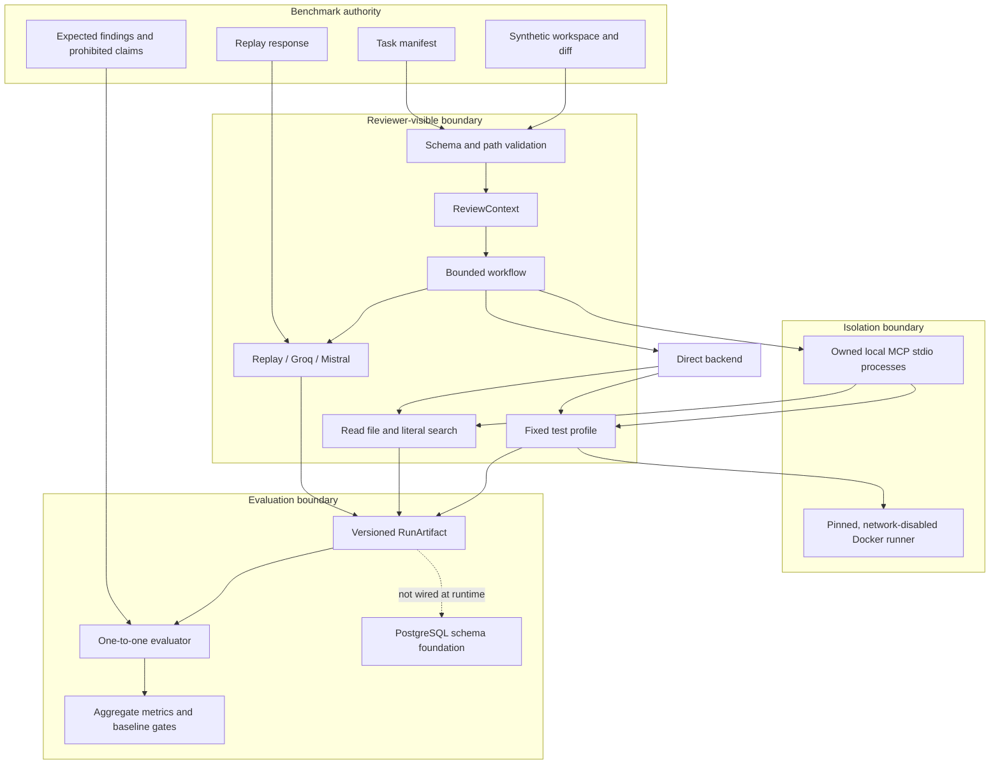

# CodeReviewOps Architecture

CodeReviewOps separates review generation from evaluation so a reviewer cannot see the
answers it is being measured against. The same domain contracts are used for deterministic
replay, live providers, direct tools, and local MCP transport.

## Trust boundaries

### Reviewer context

Only the issue description, diff, and bounded tool context enter the reviewer contract.
Expected findings and prohibited phrases remain on the evaluation side. Tests prove that
replay and live-provider adapters cannot receive golden labels.

### Filesystem access

Benchmark references must be relative POSIX paths beneath the benchmark root. Absolute
paths, traversal, links, reparse points, special files, binary content, `.git`, and
oversized workspaces are rejected. Artifacts contain relative paths and sanitized tool
arguments rather than host paths.

### Tool execution

The model cannot submit shell commands. A task may declare only:

- bounded file reads;
- literal code searches;
- the fixed `python-unittest-v1` test profile.

Direct and MCP transports implement the same typed contracts. MCP mode launches fixed
local Python modules over stdio and records protocol, capability, schema, lifecycle, and
semantic-trace fingerprints.

### Test isolation

The pinned Docker runner has no network, no added capabilities, no new privileges, a
read-only root filesystem and workspace mount, a non-root user, resource limits, bounded
output, and a hard deadline. Docker failure is visible; execution never falls back to the
host.

## Execution paths

### Deterministic evaluation

Replay is the default for tests and CI. It exercises schema validation, tools, evidence
linking, evaluation, artifact publication, transport parity, and regression thresholds
without an API key.

### Live evaluation

Groq and Mistral runs are opt-in and make one request to one explicitly selected model.
Keys come only from the process environment. There is no automatic retry, redirect,
provider fallback, model substitution, or persisted secret.

### Persistence status

SQLAlchemy models and an initial Alembic migration define the PostgreSQL persistence
foundation. No public API currently exposes it, and CLI review runs are not persisted.
This is intentionally described as foundation work rather than a completed platform API.

## Design priorities

1. Measurement before product surface area.
2. Evidence and provenance before persuasive prose.
3. Deterministic replay before live-provider comparison.
4. Bounded capabilities before autonomous tool use.
5. Visible failures before hidden fallback behavior.
